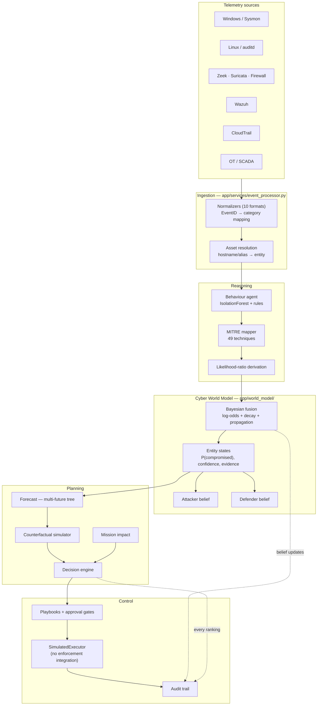
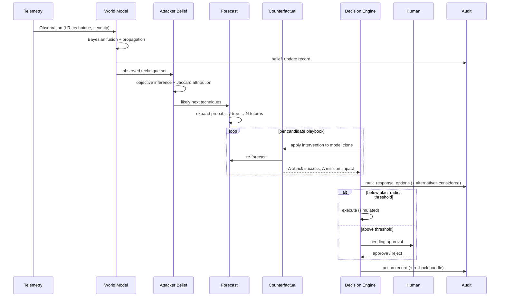
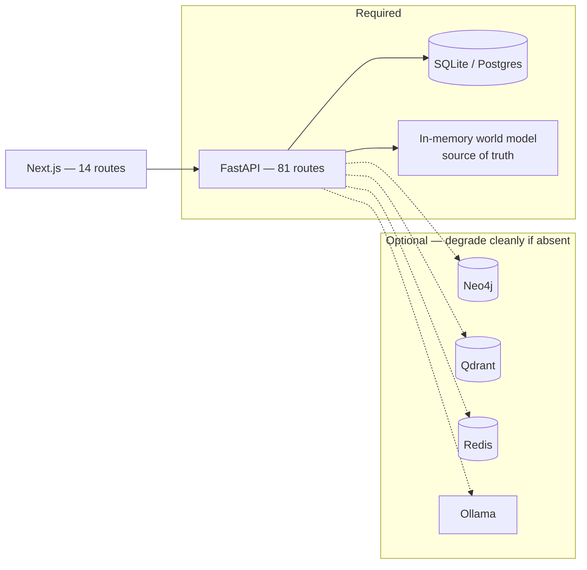

# Sentinel — Architecture

Cyber World Model for Critical National Infrastructure.

Everything below describes code that exists in this repository. Where a
capability is simulated rather than enforced, the diagram and text say so.

---

## 1. System overview



---

## 2. The world model — probabilistic state

The model never stores `Server = Compromised`. It stores a posterior belief with
the evidence that produced it.

```mermaid
flowchart LR
    OBS["Observation<br/>likelihood_ratio"] --> LO["log-odds<br/>prior + Σ log(LR)"]
    LO --> DEC["Recency decay<br/>6h half-life"]
    DEC --> P["P(compromised)"]
    DEC --> C["Confidence<br/>independent evidence count"]
    P --> PROP["Neighbour propagation<br/>direction-aware, √degree-normalised<br/>max depth 2"]
    PROP -.derived evidence, weight 0.30.-> LO
    P --> ST{"State"}
    ST -->|"< 0.2"| H["healthy"]
    ST -->|"< 0.5"| S["suspicious"]
    ST -->|"< 0.8"| L["likely_compromised"]
    ST -->|">= 0.8"| X["compromised"]
```

**Why log-odds.** Evidence combines additively, so independent observations
accumulate without saturating, and a single contradicting observation cannot
erase a well-supported belief.

**Why direction-aware propagation.** Compromise of a domain controller strongly
implicates principals that authenticate against it; the converse is weak. An
earlier symmetric implementation pushed 28 entities to ~0.99 from one phishing
alert because the DC is a hub. Fan-out is normalised by `√degree` so hubs do not
broadcast.

**Why derived evidence is discounted.** Propagated belief is not independent
evidence. It is keyed by origin observation (collapsing multi-hop copies) and
weighted at 0.30, otherwise entities with no first-party telemetry reported high
confidence and the defender belief model saw no uncertainty anywhere.

---

## 3. Reasoning → planning → control



---

## 4. Deployment



The in-memory world model is the sole source of truth. Neo4j persistence is
best-effort and write-only; nothing is read back. `uvicorn app.main:app` runs
with every optional service down — verified.

---

## 5. Honest capability boundaries

These are stated here because the architecture is only meaningful alongside what
it does *not* do.

| Area | Status |
|---|---|
| Behavioural detection | Real sklearn IsolationForest, fitted on accumulated baselines, fused with a rules engine. Measured on a synthetic labeled corpus — see `app/evaluation/`. |
| MITRE attribution | Real keyword + fuzzy mapping over a **49-technique** subset of ATT&CK Enterprise (~625), **zero sub-techniques**. Mapper confidence is a constant and is not calibrated. |
| Attack forecasting | Deterministic probability-tree expansion over a hand-authored transition matrix. Not learned from campaign data. |
| Counterfactual | Real — deep-copies the model, applies the intervention, re-forecasts, reports severed paths. |
| Mission impact | Real — availability degrades from dependent-entity beliefs over a hand-authored function/dependency map. |
| Response execution | **Simulated.** `SimulatedExecutor` renders commands and records them. There is **no** firewall/AD/EDR/hypervisor integration. Every payload carries `mode: "simulated"`, `integration: "none"`, `enforced: false`. |
| Human-in-the-loop | Real approval gating, pending queue, approve/reject/rollback state machine — gating a simulated action. |
| Audit trail | Real, append-only, covers belief updates and every automated decision including alternatives considered. In-memory: does not survive restart. |
| Deception | Deployed assets become real world-model entities so forecasts route through them. Nothing is deployed to a real network. |
| Threat intel | Live MITRE CTI, CISA KEV and NVD fetchers exist. **CERT-In is a stub** (`relate_to_event()` returns `None`). |
| Evaluation corpus | **Synthetic**, deterministic under a fixed seed. Not real-world performance. An adapter for CICIDS2017/UNSW-NB15/BETH is documented but unused. |
| MTTD/MTTR baseline | External industry reference (IBM 2024), **not** a SOC measured here. Not a like-for-like comparison. |

---

## 6. Where things live

| Path | Contents |
|---|---|
| `app/world_model/` | Entity state, Bayesian fusion, attacker/defender belief, forecast, counterfactual, mission impact, decision engine, deception, audit, seed |
| `app/agents/` | 14 agents — behaviour, MITRE mapper, attack story, prediction, blast radius, response, playbooks, correlation, vuln prioritisation, learning, coordinator |
| `app/ml/` | IsolationForest detector, Laplace-smoothed sequence model, structural graph embedder |
| `app/services/` | Telemetry normalizers (10 formats), threat intel feeds, notifications, analytics |
| `app/knowledge_graph/` | Neo4j manager, attack-path analyzer, Qdrant embeddings |
| `app/scenarios/` | 3 labeled APT chains with ground truth |
| `app/evaluation/` | Labeled corpus, detection / attribution / response / timing harnesses |
| `frontend/src/app/` | 14 routes |
| `tests/` | 87 tests |
